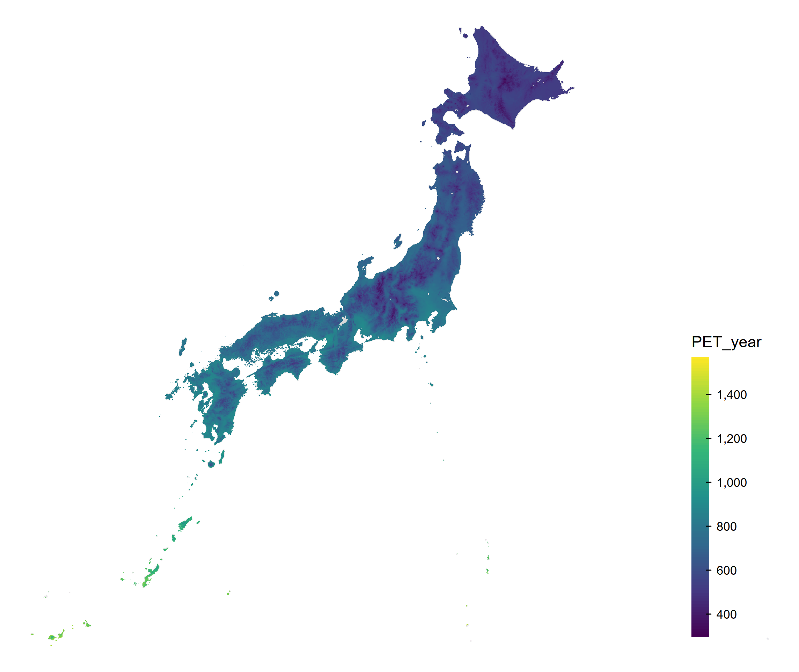
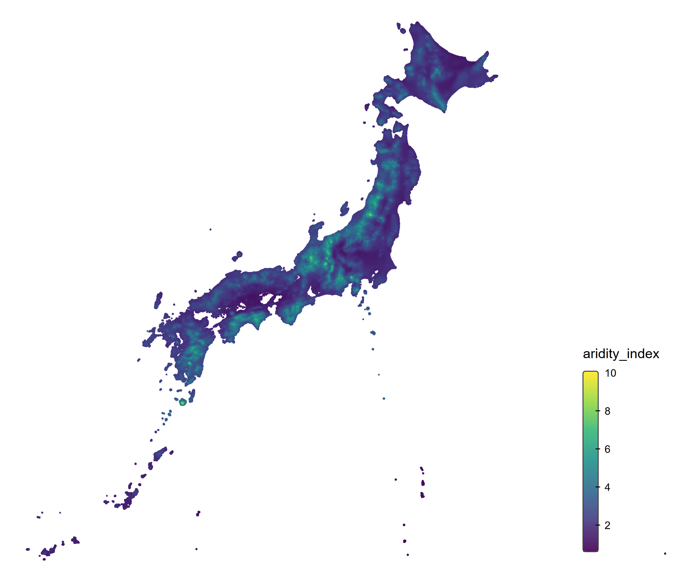

# japanese-climate-calculation

[英語版READMEはこちら (English version)](README.md)

[ドキュメント全体はこちら](https://maple60.github.io/japanese-climate-calculation/)

<p align="center">
  
  
</p>

日本の気候メッシュデータを処理し、潜在蒸発散量（PET）や乾燥度指数（Aridity Index）などの追加的な気候指標を導出するための、再現可能な R + [Quarto](https://quarto.org/) プロジェクトです。

## 概要

このリポジトリでは、以下を基にしたワークフローを文書化しています。

- 気象庁: [メッシュ平年値2020](https://www.data.jma.go.jp/stats/etrn/view/atlas.html)
- 国土交通省 国土数値情報: [平年値メッシュデータ](https://nlftp.mlit.go.jp/ksj/gml/datalist/KsjTmplt-G02-v3_0.html)

主な出力は次のとおりです。

- クリーニング済みの気候メッシュデータセット
- PET（Thornthwaite 法）
- 乾燥度指数（`Precipitation / PET`）
- 任意座標から最寄りの気候値を取得するユーティリティ関数
- 日本地図の可視化例

## ドキュメント（GitHub Pages）

ドキュメント全体は以下で公開しています。

- [https://maple60.github.io/japanese-climate-calculation/](https://maple60.github.io/japanese-climate-calculation/)

- 英語を主としたドキュメントは `docs/` から公開されています。
- 各英語ページには、対応する日本語ページへのリンクがあります。

このサイトはデフォルトブランチの `/docs` から配信されます。

## プロジェクト構成

- `index.qmd`: 英語ランディングページ
- `index_ja.qmd`: 日本語ランディングページ
- `notebooks/*.qmd`: 英語チャプター
- `notebooks/*_ja.qmd`: 日本語チャプター
- `R/get_nearest_climate_value.R`: 最近傍取得ユーティリティ関数
- `_quarto.yml`: book/site 設定

## セットアップ

### 1. リポジトリをクローン

```bash
git clone <your-repo-url>
cd japanese-climate-calculation
```

### 2. R 環境を復元

```r
renv::restore()
```

### 3. データディレクトリを設定

`.Renviron` に `PROJECT_DATA_DIR` を設定してください（例）。

```bash
PROJECT_DATA_DIR=/path/to/your/data/root
```

## ドキュメントのビルド

Quarto book をレンダリングします。

```bash
quarto render
```

生成ファイルは `docs/` に出力されます。

## データとライセンスに関する注意

このリポジトリでは、元データセットを**再配布していません**。
必要なファイルは公式ソースからダウンロードし、各利用規約に従ってください。

- 国土数値情報 利用約款: https://nlftp.mlit.go.jp/ksj/other/agreement.html

## 引用と帰属表示

国土数値情報データセットの派生物を利用する場合は、提供元の規約に従って必要な帰属表示を行ってください。

## 言語ポリシー

- ソースコードのコメントおよび主要ドキュメントは英語で維持します。
- アクセシビリティと継続性のため、日本語の対応ページを提供します。

## コントリビュート

Issue と Pull Request を歓迎します。
コードコメントとエラーメッセージは英語で統一してください。

## ライセンス

このリポジトリ内のコードは [MIT License](LICENSE) のもとで提供されます。

ドキュメント本文およびオリジナル図版は、特記がない限り [Creative Commons Attribution 4.0 International License (CC BY 4.0)](https://creativecommons.org/licenses/by/4.0/deed.ja) のもとで提供されます。

このリポジトリでは気候・地理空間の元データセットを再配布しておらず、これらのライセンスの対象外です。
元データセットは必ず公式提供元から取得し、提供元の利用規約に従ってください。
